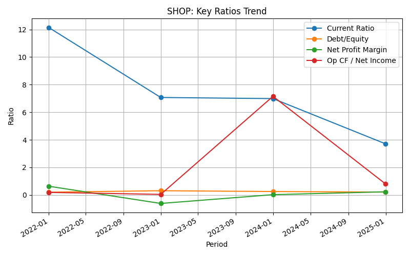
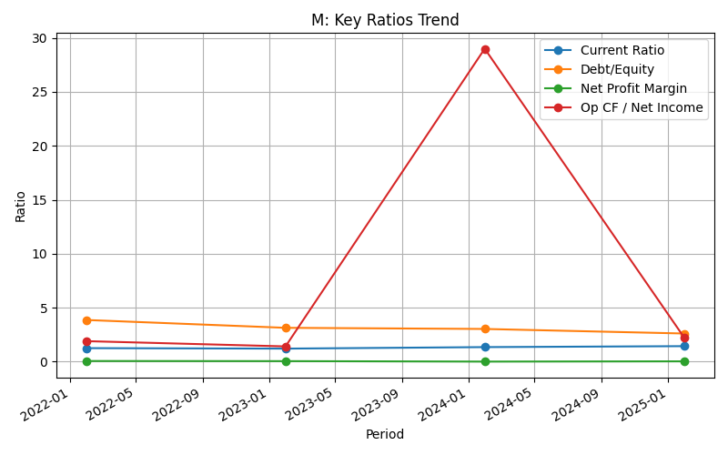

# Credit Risk & Financial Forensics: Red Flag Analysis of Shopify and Macy’s

> **Merchant Underwriting & Financial Statement Storytelling with Python**

---

## Executive Summary

This project demonstrates how data-driven financial analysis can uncover key credit risks and operational red flags for major e-commerce and retail merchants. Using public financial data and Python visualizations, I evaluated the financial health of **Shopify (SHOP)** and **Macy’s (M)** to produce actionable insights for credit decision-making and risk monitoring.

---

## Project Overview

**Purpose:**  
To simulate real-world merchant underwriting by surfacing early warning signs (“red flags”) in financial statements—combining business judgment, data visualization, and credit risk best practices.

**What’s Included:**  
- Concise financial health reports for Shopify and Macy’s
- Clean, easy-to-read visualizations of key metrics
- Executive-level recommendations based on findings

---

## Data & Methodology

- **Companies:** Shopify (SaaS/e-commerce), Macy’s (omnichannel retail)
- **Data:** Publicly available annual financial statements (2020–2024)
- **Tools:** Python, pandas, matplotlib (see [`redflag_analysis.py`](./redflag_analysis.py))
- **Metrics:** Current Ratio, Debt-to-Equity, Net Profit Margin, Operating Cash Flow / Net Income
- **Process:** Automated data cleaning, multi-year trend analysis, visual dashboards, and a written “Red Flag” summary for each merchant

---

## Key Findings & Visual Highlights

### Shopify (SHOP)
- **Strength:** Strong revenue growth and high liquidity
- **Red Flags:**  
  - Negative profit margin in some years
  - Operating cash flow often trails net income (possible earnings quality issue)
  - Declining current ratio over time (shrinking liquidity buffer)

---

### Macy’s (M)
- **Strength:** Solid operating cash flow conversion
- **Red Flags:**  
  - High and rising leverage (debt-to-equity above 2.5)
  - Persistently slim profit margins (vulnerable to shocks)
  - Liquidity adequate for now, but at risk if leverage continues rising

---

## Summary Table of Operational Red Flags

| Company   | Key Red Flag(s)                    | Credit Risk Implication                      |
|-----------|------------------------------------|----------------------------------------------|
| Shopify   | Negative profit, Op CF < Net Income, declining liquidity | Possible cash flow and operational stress    |
| Macy’s    | High/rising leverage, slim margins | Elevated solvency and refinancing risk       |

---

## Recommendations

- **Shopify:** Approve with conditions—monitor cash flow and liquidity trends, request more frequent reporting.
- **Macy’s:** Approve with caution—closely monitor debt levels and margin trends, set conservative credit exposure.

---

## Why This Matters

Merchant risk assessment is essential in lending, trade finance, and business analytics. This project models how financial forensics, business analysis, and effective data storytelling can power smarter credit decisions and proactive risk management.

---

## About Me

**Ruomeng Sun**  
Data analytics & financial modeling enthusiast | [LinkedIn](https://www.linkedin.com/in/ruomengsun/) | [Email](synruomeng@gmail.com)

---

